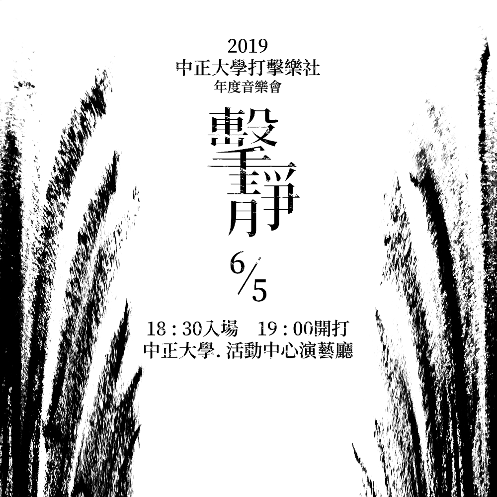

# 子象の行進 
### 作曲：Henry Mancini　
### 編曲：小栗克巳 
###  表演人員：吳宜蓁、林駿杰、侯秉佑、唐偉宸、梁菡軒、鄭崴安 　

《子象的行進》是美國的作曲家Henry Mancini為1962年的電影《Hatari!》所寫的配樂，此曲不但使電影增色，也為他贏得了Grammy最佳樂器安排獎。  
另外，中國醫藥大學亦採用一小段作為學校的下課鈴聲。  
配樂的場景為Elsa Martinelli帶領三隻小象進入水坑洗澡，小栗克巳以高音木琴、鐵琴與馬林巴分別代表三隻小象，再藉由Bongo、大鼓及不同小樂器的敲擊下表現出小象那充滿青春活力的傻氣個性，而馬林巴重複的低音伴奏亦呈現了原版boogie-woogie的爵士風格。  
